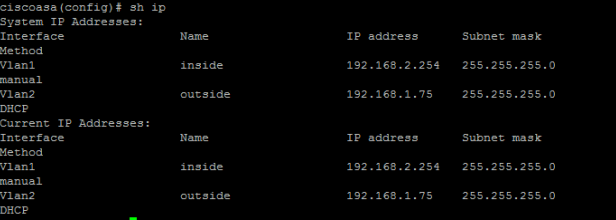
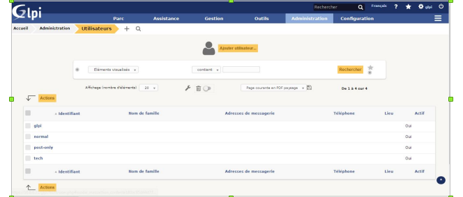
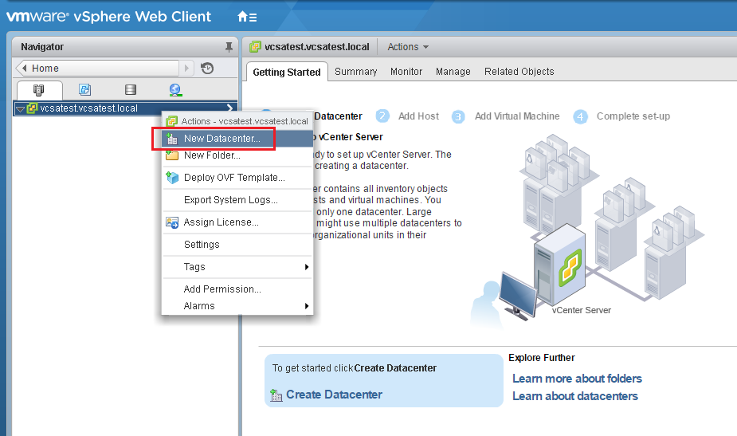
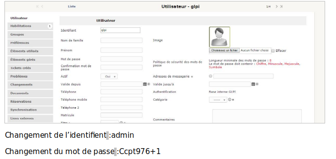
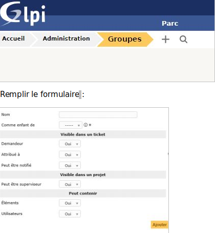
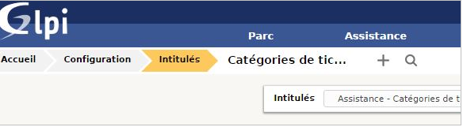

**PORFOLIO DE L'ETUDIANT ABDOU FAZUL**
### cv:
**ABDOU Fazul**

Né le 26/07/200

1 b rue du tennis
 
97615 Labattoir 

e-mail:abdou.fazul.97610.97610@gmail.com

Tél: 0639650655

## Diplome:

**2019** Lycée de Younousa Bamana:
	Validation de la 1er année du BTS SIO

**2018** Lycée de Petite-Terre:
	Bac S mention assez bien en Terminal S spécialité ISN

**2014** Collége Boueni-M'titi:
	Brevet national en 3éme

## Competance :
-Maitice le Pack Office.

-Maitrice le langage Python(utulisation de Pygames)

-Maitrice HTML

-Maitrice le langage JAVA

-Maitrice de Jekyll, d'un blog, site web*

-Maitrice des OS Lunix, Unbuntu et Windows

-Maitrice du serveurs

-Maitrice des basses de données et SQL

-Mairice de la virtualisation de Paket Tracer 

-Maitrice de GLPI( gestion des insidents)

## langage:
**Anglais**:

`Intérmédiaire`

**Espagnole**:

`Niveau Moyen`

## Centre d'Interet:
Football

Basketball

Natation(moyen)

Handball

### STAGE BTS Service informatique des organisations:
## Détail stage 1er année:
**1er semaine(lundi 8 au vendredi 12 avril):**

Durant cette semaine, j'ai eu la chance de pouvoir voir le systeme informatique et des équipements tel que des serveurs, switch, firewall et onduleurs. J'ai alors eu une 1er mission de reconnaitre les cables des switchs en trouvant chaque VLAN qui est sur chaque port du switch. Pour realiser cela j ai utulisé le logiciel du switch D-LINK pour trouver les VLAN de chaque port et ainsi leurs données un couleurs à chaque cable RJ45 pour idantifiant les VLANS ou elles se situent et identifieés les cables didiés au chaque VLAN.

De plus j'ai aussi appris a configuré un par feu (model cisco asa 5505) pour l'inseret dans un reseaux bien particulié.J'ai donc utuliser internet pour m'informer et aussi eu l'aide de mon tuteur cependant j'ai appris que il faut connecter un cacle RJ45 à un des ports du firewall puis j'ai utulisé le logiciel PuTTY pour me connecter au ligne de commande en passant par le port COM ensuite j'ai configurer tel sorte à avoir un réseaux et que le firewall soit une passeral (reseaux 192.168.2.0/24) pour que à la fin je telecharge CISCO ASDM et configurer le par feu.

À la fin de la semaine j'ai entamé le second projet c'est de crée un GLPI possedant les options de gestion de tikets et l'inventory pour gerer les services de Pamandzi, Labattoir et de la CCPT. Mais j'ai dabord enchainer sur un travail de recherche pour bien choisir la distribution adapter et aussi m'informer sur les options qui doivent etre instaler avec GLPI et utuliser anterieurement.

**2émé semaine(lundi 15 au vendredi 19 avril):**

Dans cette semaine j'ai pu assisté à une formation informatique sur l'utulisation de certain materiel informatique comme l'utulisation du SAN , des serveurs , VWWARE ,Vsphere qui était dedié au service informatique. J'ai pu decouvrire d'autre module de VM , j'ai pu aussi participer dans cette formation durant certain exercice qui été donner.

Et à la fin de la semaine j'ai entamer le projet principale du stage il s'agit de GLPI cependant il fallait faire un travail de recherche pour bien me decumenter.

**3éme semaine(Mardi 23 au vendredi 26 avril):**
En debut de la semaine j'ai continuer sur mon travail de recherche puisque je ne savais pas sur quoi partir pour GLPI et la configuration de la gestion de tikets et aussi une configuraton d'un gestionnere de parc avec OCS. Cependant il y a eu un retard suite à l'alerte cyclonique j'ai pu reprendre mes recherche sur le projet en fin de semaine.

**4éme semaine(lundi 29 avril au vendredi 3 mai):**

En debut de semaine j'ai commencé le projet en partant une distribution E.o.N qui en barque la distribution GLPI c est une distribution LUNIX, j'ai aussi pu apprendre à configurer le GLPI créer en utilisant des tuto sur youtube pour configurer le GLPI avec un active directory et aussi realiser la configuration pour la gestion des tikets puis j'ai voulu integret une fonction sur GLPI pour ameliorer une certaine fonctionnalite mais il y a eu un probleme puisque la version du GLPI ne pouvait pas utiliser les Pluging de GLPI. 

Ainsi je suis repartie pour utiliser la distribution debian sur GLPI en creyant une machine Virtuel pour continuer le projet en repartant de Zero.

**5éme semaine (lundi 6 au vendredi 10 mai):**

Durant cette derniere semaine j'ai rencontrainé plusieurs problémes concernant la finalisation de projet à commencer par le téléchargement d'un outil qui fonctionne avec GLPI, c'est OCS Inventory. Suite au nombre probléme rencontrer on a decidé d'utiliser un autre outil qui remplace OCS Inventory c est fusionInventory 

également j'ai fait un documment word pour leurs laisser des traces pour maitricé GLPI et ces outils en leurs donnant aussi les codes administratrateurs pour ce connecter puisque cette plateforme doit etre utiliser dans leurs sociéter et dans les communes de Pamandzi et de Dzaoudzi. 
