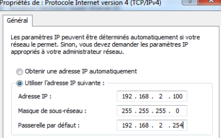

## Welcome to GitHub Pages
**1er semaine(lundi 8 au vendredi 12 avril):**

Durant cette semaine, j'ai eu la chance de pouvoir voir le systeme informatique et des équipements tel que des serveurs, switch, firewall et onduleurs. J'ai alors eu une 1er mission de reconnaitre les cables des switchs en trouvant chaque VLAN qui est sur chaque port du switch. Pour realiser cela j ai utulisé le logiciel du switch D-LINK pour trouver les VLAN de chaque port et ainsi leurs données un couleurs à chaque cable RJ45 pour idantifiant les VLANS ou elles se situent et identifieés les cables didiés au chaque VLAN.


De plus j'ai aussi appris a configuré un par feu (model cisco asa 5505) pour l'inseret dans un reseaux bien particulié.J'ai donc utuliser internet pour m'informer et aussi eu l'aide de mon tuteur cependant j'ai appris que il faut connecter un cacle RJ45 à un des ports du firewall puis j'ai utulisé le logiciel PuTTY pour me connecter au ligne de commande en passant par le port COM ensuite j'ai configurer tel sorte à avoir un réseaux et que le firewall soit une passeral (reseaux 192.168.2.0/24) pour que à la fin je telecharge CISCO ASDM et configurer le par feu.



À la fin de la semaine j'ai entamé le second projet c'est de crée un GLPI possedant les options de gestion de tikets et l'inventory pour gerer les services de Pamandzi, Labattoir et de la CCPT. Mais j'ai dabord enchainer sur un travail de recherche pour bien choisir la distribution adapter et aussi m'informer sur les options qui doivent etre instaler avec GLPI et utuliser anterieurement.
### Markdown

Markdown is a lightweight and easy-to-use syntax for styling your writing. It includes conventions for

```markdown
Syntax highlighted code block

# Header 1
## Header 2
### Header 3

- Bulleted
- List

1. Numbered
2. List

**Bold** and _Italic_ and `Code` text

[Link](url) and 
```

For more details see [GitHub Flavored Markdown](https://guides.github.com/features/mastering-markdown/).

### Jekyll Themes

Your Pages site will use the layout and styles from the Jekyll theme you have selected in your [repository settings](https://github.com/Kerciel/porfolio2/settings). The name of this theme is saved in the Jekyll `_config.yml` configuration file.

### Support or Contact

Having trouble with Pages? Check out our [documentation](https://help.github.com/categories/github-pages-basics/) or [contact support](https://github.com/contact) and we’ll help you sort it out.
